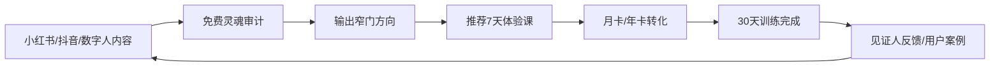

# 窄门 NarrowGate 商业落地手册

更新时间：2026-05-28

## 1. 商业定位

窄门不是心理治疗平台，也不是泛成长鸡汤内容。它的商业定位是：

> 面向高自我要求但长期卡住的人，用灵魂审计、100门课程、30天行动训练和见证机制，把“知道但做不到”转化为可记录、可复盘、可见证的真实行动。

### 核心承诺

- 看见：用苏格拉底式追问识别回避、合理化、讨好、拖延和自欺。
- 学习：用100门深度课程提供认知、情绪、行为、关系、事业、整合六条路径。
- 行动：用30天穿越训练把洞察变成每天可执行的动作。
- 见证：用见证人、经验值和里程碑记录改变，不让成长停留在感动。

### 边界声明

- 不承诺诊断、治疗、治愈疾病。
- 不替代心理咨询、精神科诊疗或危机干预。
- 对外宣传使用“自我觉察、行动训练、成长课程、见证机制”，避免使用“治疗、疗愈保证、心理疾病解决”等高风险表达。

## 2. 目标用户

### B2C 核心人群

| 人群 | 痛点 | 触发语 | 首推产品 |
| --- | --- | --- | --- |
| 25-40岁高压职场人 | 长期拖延、焦虑、关系消耗 | “我知道该做什么，但就是做不到” | 7天入门营 + 月卡 |
| 创业者/管理者 | 决策孤独、压力大、无法稳定执行 | “我需要一个不讨好我的镜子” | 年卡 + 见证人系统 |
| 自我成长深度用户 | 看过很多书但没有行动证据 | “我不想再收藏方法论了” | 100门课程库 |
| 关系困扰用户 | 讨好、边界弱、反复内耗 | “我总在关系里失去自己” | 关系真实课程包 |

### B2B/B2B2C 人群

| 客户 | 购买理由 | 方案 |
| --- | --- | --- |
| 心理咨询机构 | 来访者课后自助练习与记录 | 小班版 ¥100/人/月 |
| 成长训练营/教育机构 | 给课程增加AI助教和行动追踪 | 标准版 ¥80/人/月 |
| 企业EAP/HR | 员工自我觉察与压力管理工具 | 机构版 ¥15,000/月起 |
| 高校心理中心 | 学生低门槛自助成长入口 | 校园试点包 |

## 3. 产品与价格

### B2C 定价

| 层级 | 价格 | 权益 | 目标 |
| --- | --- | --- | --- |
| 免费版 | ¥0 | 1次灵魂审计、7天体验、部分课程试听 | 获客与信任建立 |
| 月卡 | ¥99/月 | 无限审计、完整30天训练、100门课程、音频导览、学习记录 | 主转化产品 |
| 年卡 | ¥799/年 | 月卡全部权益、年度复盘、进阶课程路径、优先新功能 | 提升LTV |
| 深度陪跑 | ¥1999/期 | 30天小班、见证人机制、每周复盘 | 高客单验证 |

### B2B 定价

沿用现有 `b2b/` 机构合作模型：

- 小班版：¥100/人/月，最多30人。
- 标准版：¥80/人/月，最多100人。
- 机构版：¥15,000/月，不限人数，适合EAP、培训机构、学校试点。

## 4. 转化漏斗

### 关键指标

| 阶段 | 指标 | 合格线 |
| --- | --- | --- |
| 内容曝光 | 完播率、收藏率、评论率 | 抖音完播 > 25%，小红书收藏 > 5% |
| 访问转化 | 内容到站点击率 | > 1.5% |
| 免费体验 | 审计开始率 | > 30% |
| 激活 | 完成首次审计 | > 45% |
| 付费 | 7天内付费率 | > 3% |
| 留存 | D7留存 | > 20% |
| 价值证明 | 30天完成率 | > 12% |

## 5. 30天落地节奏

### 第1周：验证定位

- 发布小红书笔记7篇、抖音短视频7条、数字人口播3条。
- 所有内容统一CTA：进入窄门，做一次免费灵魂审计。
- 记录用户评论中的真实话术，建立“痛点词库”。
- 建立种子用户表，手动跟进前50个用户。

### 第2周：验证转化

- 上线7天体验路径：审计后推荐对应课程。
- 推出月卡和年卡权益说明。
- 小红书重点写长笔记，抖音重点做强钩子短视频。
- 每天复盘：哪个痛点带来最高审计开始率。

### 第3周：验证付费

- 发布3个用户故事模板：拖延、关系、事业卡点。
- 开始B2B邀约：心理咨询机构、成长训练营、EAP服务商。
- 发起“7天窄门挑战”社群，验证陪跑服务。
- 对前20名深度用户做访谈。

### 第4周：验证复购与案例

- 整理3个真实改变案例，形成二次传播内容。
- 对付费用户推送30天训练完成激励。
- 产出机构合作PPT和演示路径。
- 根据数据决定主推：B2C月卡、深度陪跑，还是B2B机构版。

## 6. 宣传内容主轴

### 内容支柱

1. 反鸡汤：不是鼓励你，而是指出你正在逃避什么。
2. 真实案例：一个人如何从“知道但不做”到留下行动证据。
3. 窄门测试：把用户带入免费灵魂审计。
4. 课程地图：100门课不是知识库，是行动路径。
5. 数字人导师：每天一个不舒服但有用的问题。

### 禁用表达

- “治愈焦虑/抑郁”
- “保证改变”
- “替代咨询”
- “诊断你的人格/疾病”
- “玄学保证、能量改命”

### 推荐表达

- “自我觉察训练”
- “行动记录”
- “课程导览”
- “见证式成长”
- “把回避变成可执行动作”

## 7. 本周执行清单

- [ ] 首页添加商业落地入口。
- [ ] 新增商业落地页面，展示价格、渠道、数字人宣传和CTA。
- [ ] 准备小红书15篇、抖音15条、数字人10条脚本。
- [ ] 建立线索收集API和表单。
- [ ] 本地验证：页面、课程库、线索提交。
- [ ] 提交并推送到 GitHub。

